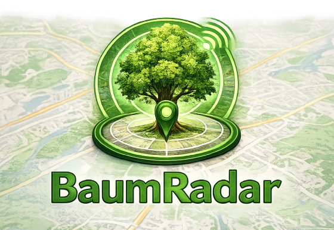
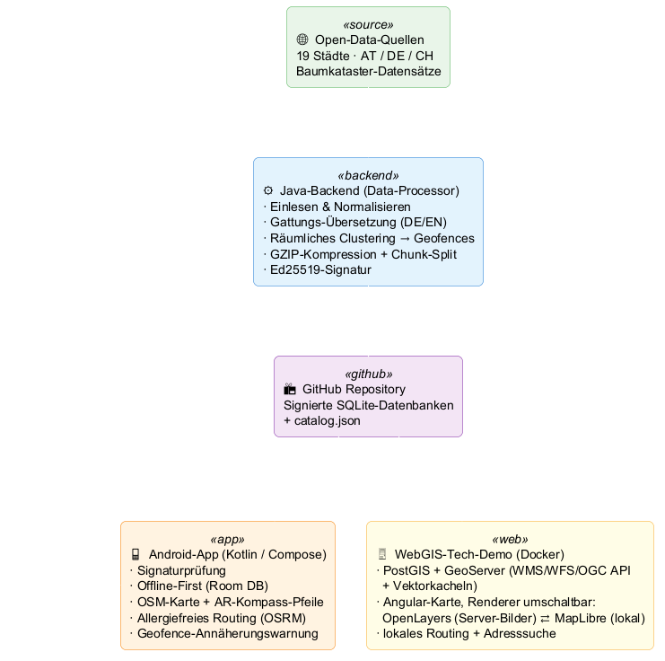
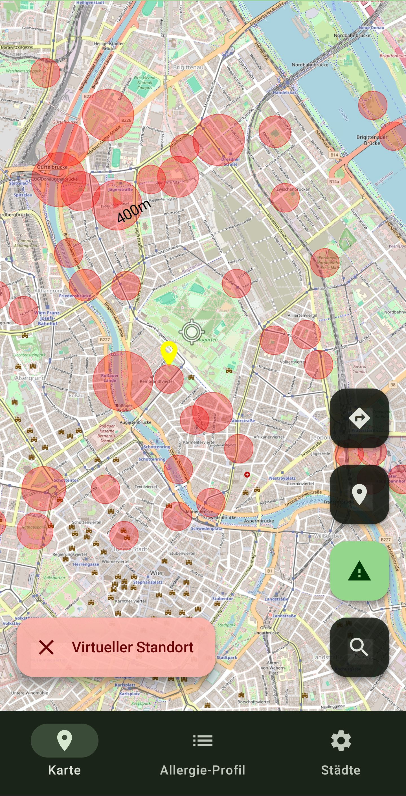
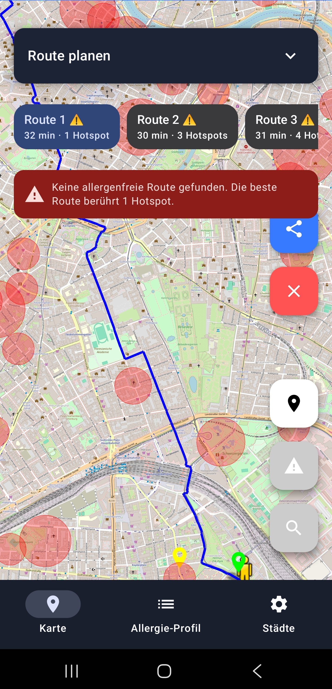
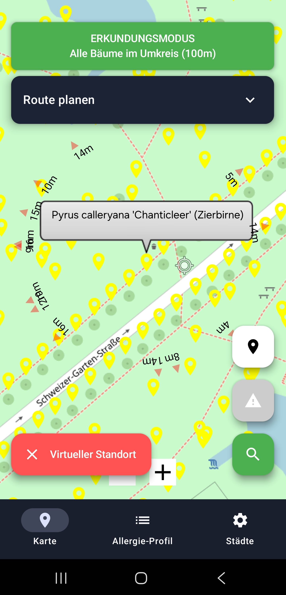
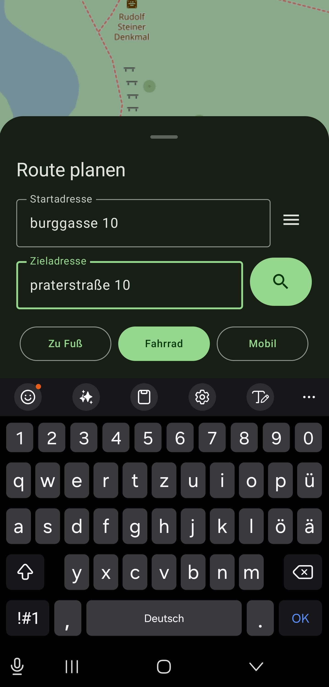
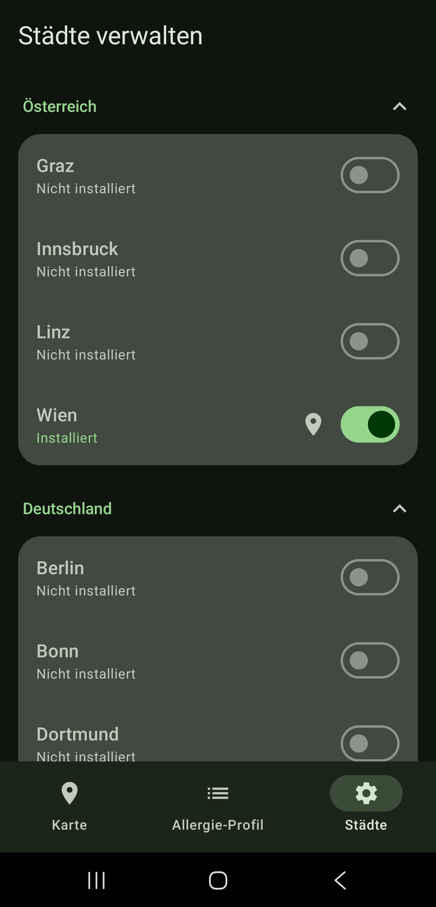
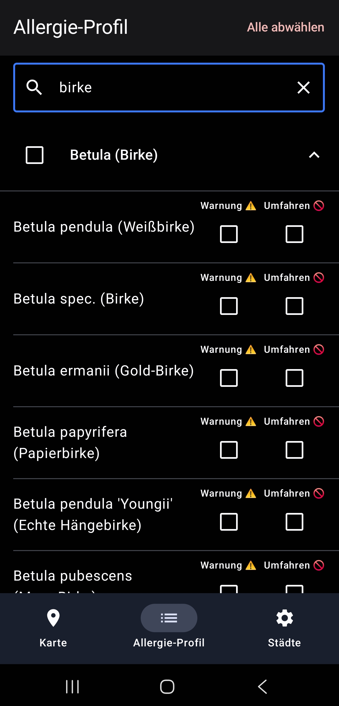

<p align="center">
  
</p>

*(For the English documentation, see [README_en.md](README_en.md))*

[](https://opensource.org/licenses/MIT)
[](#-webgis-tech-demo-docker)
[](https://kotlinlang.org)
[](https://openjdk.org)
[](https://angular.dev)
[](docs/webgis_architecture.md)
[](webgis/README.md)
[](#-technische-dokumentation)
[](#-multi-city-support)
[](docs/data_structure.md)

> **Baumradar ist ein Open-Data-basiertes Werkzeug, mit dem Bäume in der direkten Umgebung erkundet und bei der Fortbewegung durch die Stadt gezielt gemieden werden können – besonders hilfreich bei einer Baumpollen-Allergie (z. B. gegen Frühblüher).** Im Hintergrund: eine Open-Data-Geodaten-Pipeline, die Baumkataster aus derzeit 19 Städten vereinheitlicht, räumlich clustert und signiert verteilt.

---

## 📐 Systemarchitektur

<p align="center">
  
</p>

---

## 📸 Screenshots

<table>
  <tr>
    <td align="center" width="33%">
      <br/>
      <b>Allergie-Hotspots</b><br/>
      <sub>Rote Zonen markieren Gebiete mit allergen-relevanten Bäumen</sub>
    </td>
    <td align="center" width="33%">
      <br/>
      <b>Intelligentes Routing</b><br/>
      <sub>Routen werden nach Hotspot-Kollisionen bewertet und sortiert</sub>
    </td>
    <td align="center" width="33%">
      <br/>
      <b>Erkundungsmodus</b><br/>
      <sub>Alle Bäume im 100m-Umkreis anzeigen und identifizieren</sub>
    </td>
  </tr>
  <tr>
    <td align="center" width="33%">
      <br/>
      <b>Multi-Modus Routing</b><br/>
      <sub>Zu Fuß, Fahrrad oder Auto – mit Allergenwarnung</sub>
    </td>
    <td align="center" width="33%">
      <br/>
      <b>Multi-City Support</b><br/>
      <sub>19 Städte in AT, DE und CH frei wählbar</sub>
    </td>
    <td align="center" width="33%">
      <br/>
      <b>Allergie-Profil</b><br/>
      <sub>Baumarten einzeln als „Warnung" oder „Umfahren" markieren</sub>
    </td>
  </tr>
</table>

---

## 🌟 Features

### 🌿 Allergie-Profil & Warn-Zonen
Im persönlichen Allergie-Profil lassen sich gezielt die Baumgattungen auswählen, die allergische Reaktionen auslösen (z. B. Birke, Hasel, Esche). Die App unterscheidet dabei zwischen zwei Stufen:
- **„Umfahren ✕"**: Diese Bäume werden beim Routing berücksichtigt – die App berechnet Routen, die diese Baumgattungen möglichst meiden.
- **„Warnung 🔔"**: Für diese Bäume registriert Baumradar im Hintergrund Geofence-Zonen bei Android. Eine **Push-Benachrichtigung direkt auf den Sperrbildschirm** erscheint, sobald sich der Standort einem solchen Baum nähert – auch bei geschlossener App. Dafür ist keine permanent laufende Hintergrund-App nötig, Android überwacht die Zonen energieeffizient über die Play Services.

### 🔍 Erkundungsmodus
*„Was ist das da für ein Baum?"* – Der Erkundungsmodus (Lupen-Icon unten rechts) zeigt **alle Bäume im Umkreis von 100 Metern** an, unabhängig vom Allergie-Profil. Jeder Marker auf der Karte zeigt den deutschen Gattungsnamen und, falls bekannt, die spezifische Art.

### 🧭 AR-Richtungsanzeige (Kompass-Pfeile)
Auf dem Karten-Bildschirm blendet Baumradar transparente Pfeile und Entfernungsangaben ein. Diese zeigen in Echtzeit die Richtung und Distanz zu den nächstgelegenen markierten Bäumen (die nächsten 15). Die Pfeile reagieren auf den Kompass (Gyroskop) und drehen sich mit – für jeden nahen Baum, egal ob er seitlich, hinter dir oder direkt vor dir liegt. So bleibt die Richtung auch dann sichtbar, wenn du gerade auf einen markierten Baum zugehst.

### 🗺️ Allergiefreies Routing
Baumradar berechnet Routen, die Allergen-Hotspots aktiv umfahren:
1. Adressen werden über den **Nominatim Geocoder** (OpenStreetMap) in Koordinaten aufgelöst.
2. Vom öffentlichen **OSRM Routing Server** werden bis zu 3 Routen-Alternativen angefragt.
3. Alle Geofence-Zonen der als „Umfahren" markierten Baumarten werden aus der lokalen Datenbank geladen.
4. Jede Route wird auf Kollisionen mit diesen Zonen geprüft (siehe [Kollisionserkennung](docs/architecture/06_collision_activity.png)).
5. Falls alle Alternativen Hotspots schneiden, werden **automatisch Umfahrungs-Wegpunkte** berechnet und eine neue Route angefragt, die die Zonen physisch umgeht.
6. Die allergenfreie Route wird als **„Allergiefrei 🟢"** markiert. Routen mit Hotspots zeigen die Anzahl der Kollisionen an (z. B. *„Route 2 ⚠️ · 3 Hotspots"*).

Die berechnete Route kann per **GPX-Export** geteilt werden, z. B. an eine Navigations-App.

### 🏙️ Multi-City Support
Unterstützte Städte:
| 🇦🇹 Österreich | 🇩🇪 Deutschland | 🇨🇭 Schweiz |
|---|---|---|
| Wien, Graz, Linz, Innsbruck | Berlin, Hamburg, Köln, Frankfurt, Stuttgart, Dortmund, Leipzig, Gelsenkirchen, Bonn, Rostock, Würzburg, Freiburg | Zürich, Basel, Zug |

Beim ersten Start wird mindestens eine Stadt ausgewählt. Bei Reisen in eine neue Stadt schlägt die App automatisch vor, die lokalen Baumdaten herunterzuladen.

### 📴 Offline First
Für jede Stadt wird eine komprimierte, aufbereitete SQLite-Datenbank heruntergeladen. Kartenanzeige, Erkundungsmodus und Hintergrund-Warnungen funktionieren danach **komplett ohne Internetverbindung**. Nur für die Routenberechnung (OSRM) wird kurzzeitig eine Verbindung benötigt.

### 🔐 Verifizierte Open Data (Ed25519-signiert)
Die Daten werden vom Backend verarbeitet und kryptografisch mit **Ed25519** signiert. Bevor die App eine heruntergeladene Datenbank verwendet, wird die Signatur gegen einen fest eingebetteten Public Key geprüft. Erst bei erfolgreicher Prüfung werden die Daten importiert – damit ist die Authentizität und Unverfälschtheit der Daten sichergestellt.

### 🔄 Selbst-Update & Daten-Aktualisierung
Beim Start prüft die App auf Neuerungen: Gibt es im GitHub-Release eine neuere App-Version, lädt und installiert sie sich auf Wunsch selbst (mit Hinweis auf die nötige Installationsberechtigung und direktem Sprung in die passende Einstellung). Ebenso werden aktualisierte oder korrigierte **Baumdaten** erkannt – jede Stadt trägt eine inhaltsbasierte Daten-Version, und bereits geladenen Städten wird ein Refresh angeboten, sobald sich ihre Daten ändern.

### 🖥️ WebGIS-Tech-Demo (Docker)
Neben der App gibt es ein **komplettes Web-GIS zum Selbst-Hosten** ([`webgis/`](webgis/README.md)): PostGIS und GeoServer publizieren dieselben signierten Datenbestände als **OGC-Dienste** (WMS 1.3.0, WFS 2.0, OGC API Features), ein Angular/OpenLayers-Client bringt Karte, Gattungsfilter und Stadt-Scoping — dazu **lokales Routing** (GraphHopper-Insel-Graph, Allergiezonen-Vermeidung per Custom Model — mit wählbarer Meidungs-Stärke von „5-fach" bis „praktisch strikt") und **lokale Adress-/POI-Suche** (Photon). Die Besonderheit: Auch Routing-OSM und Geocoder-Index werden aus **pro Stadt geschnittenen, signierten Häppchen** gespeist — wer nur Zug ausprobiert, lädt für die Adresssuche 25 MB statt der 11 GB fertiger Länder-Indizes. Ein Befehl genügt (nur Docker nötig):

```powershell
cd webgis
.\start.cmd -Cities zug      # Karte + lokales Routing + lokale Adresssuche für Zug
```

→ [Schnellstart & Dienste](webgis/README.md) · [Architektur-Doku mit Lessons Learned](docs/webgis_architecture.md)

---

## 🚀 Installation

### APK-Download (empfohlen)
1. Die aktuellste `Baumradar.apk` aus den [Releases](https://github.com/matthili/BaumRadar/releases) herunterladen.
2. Auf dem Smartphone die Installation aus „Unbekannten Quellen" erlauben.
3. APK öffnen und den Anweisungen folgen.
4. Beim ersten Start: Mindestens eine Stadt auswählen und deren Daten herunterladen.
5. Berechtigungen für Standort (inkl. Hintergrund-Standort für Geofence-Warnungen) und Benachrichtigungen erteilen.

### Selber kompilieren
```bash
git clone https://github.com/matthili/BaumRadar.git
cd BaumRadar
./gradlew assembleDebug
# Die APK findet sich unter app/build/outputs/apk/debug/
```
**Voraussetzungen:** Android Studio (aktuelle Version), JDK 21, Android SDK 34.

---

## 🎮 Bedienung

### Ersteinrichtung
Beim allerersten Start erscheint ein **Städte-Assistent**. Hier werden per Schalter die gewünschten Städte ausgewählt. Die App zeigt einen Lade-Fortschritt inkl. Signatur-Verifizierung an. Danach geht es mit „Weiter" zum Hauptbildschirm.

### Hauptbildschirm (Tabs)
Die App hat am unteren Rand eine Tab-Leiste mit drei Bereichen:

| Tab | Funktion |
|-----|----------|
| **🗺️ Karte** | OpenStreetMap-Karte mit Standort, Allergie-Bäumen (gelbe Pins, bei kleinem Zoom zu grünen Zähl-Bubbles gebündelt), Geofence-Zonen (rote Kreise), berechneten Routen. Buttons unten rechts: 🧭 Route planen (öffnet ein Eingabe-Sheet), 📍 Zentrieren, ⚠️ Hotspots einblenden, 🔍 Erkundungsmodus |
| **👤 Allergie-Profil** | Durchsuchbare, nach Gattung gruppierte Baumliste. Pro **Gattung** zwei Schalter: „Warnung 🔔" (Hintergrund-Benachrichtigung) und/oder „Umfahren ✕" (Routing). Aufklappen zeigt die Arten mit botanischem Namen; die Auswahl gilt gattungsweit. |
| **🏙️ Städte** | Heruntergeladene Städte verwalten: weitere laden, bestehende löschen, zur Kartenposition springen. |

### Langes Drücken auf die Karte
Ein langer Druck auf eine beliebige Stelle der Karte öffnet ein Kontextmenü:
- **Virtueller Standort setzen**: Für Tests oder Vorausplanung – die App verhält sich, als wäre der Standort an diesem Punkt.
- **Route HIER starten/beenden**: Setzt Start- bzw. Endpunkt für eine Route.

---

## 📖 Technische Dokumentation

Baumradar besteht aus zwei Hauptteilen und einer offenen Datenstruktur:

| Dokument | Beschreibung |
|----------|-------------|
| [**Android App Architektur**](docs/app_architecture.md) | Kotlin-App, Jetpack Compose UI, Room-Datenbanken, Routing-System, Hintergrund-Geofences |
| [**Backend / Data-Processor**](docs/backend_architecture.md) | Java-Backend: Open Data einlesen, übersetzen, clustern, in Chunks splitten, signieren |
| [**Datenstruktur & Third-Party**](docs/data_structure.md) | Offene, verifizierte Baumdaten für eigene Apps (iOS, Web) nutzen – mit Code-Beispielen |
| [**WebGIS-Tech-Demo**](docs/webgis_architecture.md) | Docker-Stack: PostGIS, GeoServer (OGC), Angular/OpenLayers, lokales Routing + Geocoding – inkl. Stolperstein-Sammlung |
| [**Glossar**](docs/glossary.md) | Alle Module, Dienste, Standards und Geo-Begriffe des Projekts erklärt – von `catalog.json` bis Zstandard |

### Architektur-Diagramme

<details>
<summary>📊 Alle Architektur-Diagramme anzeigen</summary>

| Diagramm | Beschreibung |
|----------|-------------|
| [Systemarchitektur](docs/architecture/01_system_architecture.png) | Gesamtübersicht aller Systemkomponenten |
| [Daten-Ingestion](docs/architecture/02_data_ingestion.png) | Wie Open Data eingelesen und verarbeitet wird |
| [App-Synchronisation](docs/architecture/03_app_sync.png) | Download, Signaturprüfung und DB-Merge |
| [Routing & Kollision](docs/architecture/04_routing_collision.png) | Allergie-Routing mit Geofence-Kollisionserkennung |
| [Backend-Klassen](docs/architecture/05_backend_classes.png) | UML-Klassendiagramm des Data-Processors |
| [Kollisions-Aktivität](docs/architecture/06_collision_activity.png) | Aktivitätsdiagramm der Kollisionserkennung |
| [App-Selbst-Update](docs/architecture/07_app_update_flow.png) | Ablauf der In-App-Aktualisierung via GitHub Releases |
| [WebGIS-Architektur](docs/architecture/08_webgis_architecture.png) | Container, Datenflüsse und Compose-Profile des Web-GIS |
| [WebGIS: Suche & Route](docs/architecture/09_webgis_route_geocoding.png) | Sequenz: Adresssuche + Routing mit Zonen-Vermeidung |

</details>

---

## 📜 Lizenz
Dieses Projekt ist unter der **MIT License** veröffentlicht. Siehe [LICENSE](LICENSE) für weitere Details.
