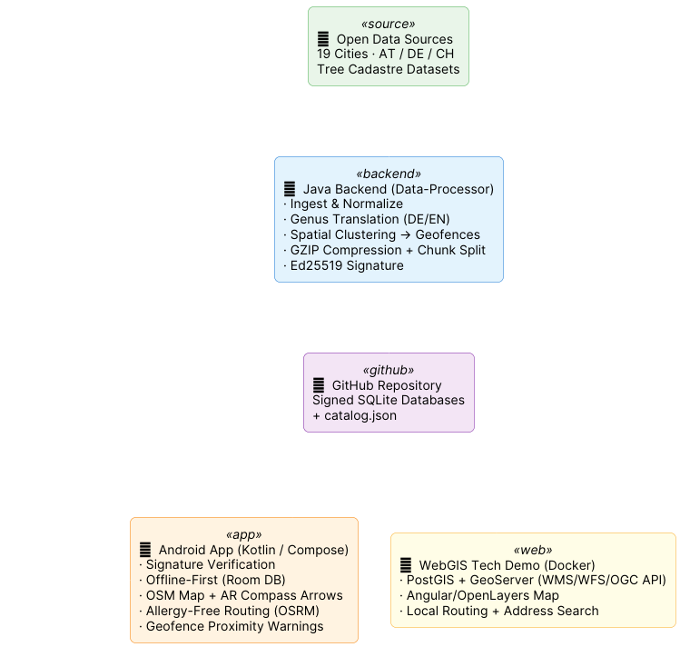

<p align="center">
  
</p>

*(Für die deutsche Dokumentation, siehe [README.md](README.md))*

[](https://opensource.org/licenses/MIT)
[](#-webgis-tech-demo-docker)
[](https://kotlinlang.org)
[](https://openjdk.org)
[](https://angular.dev)
[](docs/webgis_architecture_en.md)
[](docs/webgis_architecture_en.md)
[](webgis/README_en.md)
[](#-technical-documentation)
[](#-multi-city-support)
[](docs/data_structure_en.md)

> **Baumradar is an Open-Data-based tool that allows you to explore trees in your vicinity and intentionally avoid them when navigating through the city – especially helpful if you suffer from tree pollen allergies (e.g., early bloomers).** Behind the scenes: an Open Data geodata pipeline that unifies tree cadastres from currently 31 cities, spatially clusters them, and distributes them with cryptographic signatures.

---

## 📐 System Architecture

<p align="center">
  
</p>

---

## 📸 Screenshots

<table>
  <tr>
    <td align="center" width="33%">
      <br/>
      <b>Allergy Hotspots</b><br/>
      <sub>Red zones mark areas with allergy-relevant trees</sub>
    </td>
    <td align="center" width="33%">
      <br/>
      <b>Intelligent Routing</b><br/>
      <sub>Routes are ranked and sorted by hotspot collisions</sub>
    </td>
    <td align="center" width="33%">
      <br/>
      <b>Exploration Mode</b><br/>
      <sub>Show and identify all trees within a 100m radius</sub>
    </td>
  </tr>
  <tr>
    <td align="center" width="33%">
      <br/>
      <b>Multi-Mode Routing</b><br/>
      <sub>Walking, cycling, or driving – with allergen warnings</sub>
    </td>
    <td align="center" width="33%">
      <br/>
      <b>Multi-City Support</b><br/>
      <sub>31 cities across AT, DE, and CH freely selectable</sub>
    </td>
    <td align="center" width="33%">
      <br/>
      <b>Allergy Profile</b><br/>
      <sub>Mark tree species individually as "Warning" or "Avoid"</sub>
    </td>
  </tr>
</table>

## 🌟 Detailed Features

### 🌿 Allergy Profile & Warning Zones
In your personal allergy profile, you select the tree genera you are allergic to (e.g., Birch, Hazel, Ash). The app distinguishes between two levels:
- **"Avoid ✕"**: These trees are considered during routing – the app tries to calculate routes that avoid these tree genera as much as possible.
- **"Warning 🔔"**: For these trees, Baumradar registers background geofence zones with Android. You receive a **push notification directly on your lock screen** when you approach such a tree – even when the app is closed. No permanently running background app is required; Android monitors the zones energy-efficiently via Play Services.

### 🔍 Exploration Mode
Standing in front of a tree and wondering: *"What kind of tree is that?"* Activate the exploration mode (the magnifying glass icon at the bottom right of the map) and Baumradar shows you **all trees within a 100-meter radius** – regardless of your allergy profile. Each marker on the map displays the common name and, if known, the specific species.

### 🧭 AR Directional Display (Compass Arrows)
On the map screen, Baumradar displays transparent arrows and distance indicators. These show you the real-time direction and distance to the closest marked trees (up to the nearest 15). The arrows respond to your compass (gyroscope) and rotate with you – one for every nearby tree, whether it's to your side, behind you, or directly ahead. That way the direction stays visible even while you're walking straight toward a marked tree.

### 🗺️ Allergy-Free Routing
Open the "Plan Route" card at the top of the screen. Enter a start and destination address and choose your mode of transport (Walking, Cycling, Driving). Baumradar:
1. Resolves the addresses to coordinates via the **Nominatim Geocoder** (OpenStreetMap).
2. Requests up to 3 route alternatives from the public **OSRM Routing Server**.
3. Loads all geofence zones for tree species marked as "Avoid" in your allergy profile from the local database.
4. Checks for each route alternative how many of these zones are intersected (see [Collision Detection](docs/architecture/06_collision_activity.png)).
5. Sorts the routes: the allergen-free route is displayed first and marked as **"Allergy-free 🟢"**.

The calculated route can be shared via GPX export, e.g., to a navigation app.

### 🏙️ Multi-City Support
Supported cities: **Vienna, Graz, Linz, Innsbruck** (Austria), **Berlin, Hamburg, Cologne, Frankfurt, Stuttgart, Dortmund, Leipzig, Gelsenkirchen, Bonn, Rostock, Würzburg, Freiburg** (Germany), **Zurich, Basel, Zug** (Switzerland). On first launch, you select at least one city. When you later move to a new city, the app automatically suggests downloading the local tree data.

### 📴 Offline First
The app downloads a compressed, processed SQLite database for each city. Once downloaded, the map display, exploration mode, and background warnings work **completely without an internet connection**. Only the routing feature (route calculation via OSRM) briefly requires a connection.

### 🔐 Verified Open Data (Ed25519-signed)
The data is processed by the backend and cryptographically signed using **Ed25519**. Before the app uses a downloaded database, it verifies the signature against a public key embedded in the app. Only after successful verification is the data imported. This ensures anyone can verify the data is authentic and untampered.

### 🔄 Self-Update & Data Refresh
On startup the app checks for updates: if a newer app version exists in the GitHub releases, it can download and install itself on request (explaining the required install permission and jumping straight to the relevant setting). It likewise detects updated or corrected **tree data** – each city carries a content-based data version, and already-downloaded cities are offered a refresh whenever their data changes.

### 🖥️ WebGIS Tech Demo (Docker)
Alongside the app there is a **complete self-hostable web GIS** ([`webgis/`](webgis/README_en.md)): PostGIS and GeoServer publish the same signed datasets as **OGC services** (WMS 1.3.0, WFS 2.0, OGC API Features), an Angular client provides the map, genus filters and city scoping — **with a choice of two map engines**: OpenLayers shows server-rendered map images, MapLibre GL renders **vector tiles directly in the browser** on the GPU (“Rendering” toggle in the panel). Plus **local routing** (GraphHopper island graph, allergy-zone avoidance via custom models — with selectable avoidance strength from "5-fold" to "effectively strict") and **local address/POI search** (Photon). The special twist: routing OSM data and the geocoder index are also fed from **per-city, signed slices** — someone trying just Zug downloads 25 MB for the address search instead of the 11 GB of pre-built country indexes. One command is all it takes (only Docker required):

```powershell
cd webgis
.\start.cmd -Cities zug      # map + local routing + local address search for Zug
```

→ [Quick start & services](webgis/README_en.md) · [Architecture doc incl. lessons learned](docs/webgis_architecture_en.md)

---

## 🚀 Installation (Android App)

### APK Download (recommended)
1. Download the latest `Baumradar.apk` from the repository (Releases tab).
2. Allow installation from "Unknown Sources" on your smartphone (usually prompted automatically when opening the file).
3. Open the APK and follow the instructions.
4. On first launch: Select at least one city and download its data.
5. Grant permissions for Location (including Background Location for geofence warnings) and Notifications.

### Build from Source
```bash
git clone https://github.com/matthili/BaumRadar.git
cd BaumRadar
./gradlew assembleDebug
# The APK can be found at app/build/outputs/apk/debug/
```
Requirements: Android Studio (current version), JDK 21, Android SDK 34.

---

## 🎮 Using the App

### Initial Setup
On the very first launch, a **City Wizard** appears. Here you toggle the cities whose tree data you want to download. The app shows download progress including signature verification. Then tap "Continue" to reach the main screen.

### Main Screen (Tabs)
The app has a tab bar at the bottom with three sections:

1. **Map (🗺️):** The main area. Here you see the OpenStreetMap map with your location (blue dot), marked allergy trees (yellow pins, bundled into green count bubbles at low zoom), geofence zones (red circles), and any calculated routes (blue polyline). At the bottom right there are four buttons:
   - 🧭 **Route planning**: Opens a bottom sheet to enter start/destination and travel mode.
   - 📍 **Center**: Jumps back to your current location.
   - ⚠️ **Hotspots**: Shows all geofence zones for your selected allergens within a 2 km radius.
   - 🔍 **Exploration Mode**: Shows all trees (of any species) within 100 m.

2. **Allergy Profile (👤):** Here you manage your allergies. You see a searchable list grouped by genus. Each **genus** has two toggles:
   - **"Warning 🔔"**: Activates background geofence notifications for the genus.
   - **"Avoid ✕"**: Considers the genus during allergy-free routing.
   
   Selection is genus-wide (matching the genus-clustered geofences). Expanding a genus reveals its species with botanical names – for reference only.

3. **Cities (🏙️):** Here you manage downloaded cities. You can download additional cities, delete existing ones, or tap the location icon to jump directly to a city's map position.

### Long Press on the Map
A long press on any point on the map opens a context menu:
- **Set Virtual Location**: For testing or pre-planning – the app behaves as if you were at this point.
- **Start Route HERE**: Sets the starting point for a route.
- **End Route HERE**: Sets the endpoint and calculates the route.

---

## 📖 Technical Documentation

Baumradar consists of two main parts and an open data structure:

| Document | Description |
|----------|-------------|
| [**Android App Architecture**](docs/app_architecture_en.md) | Kotlin app, Jetpack Compose UI, Room databases, routing system, background geofences |
| [**Backend / Data-Processor**](docs/backend_architecture_en.md) | Java backend: read Open Data, translate, cluster, split into chunks, sign |
| [**Data Structure & Third-Party Usage**](docs/data_structure_en.md) | Use the open, verified tree data in your own apps (iOS, Web) – with code examples |
| [**WebGIS Tech Demo**](docs/webgis_architecture_en.md) | Docker stack: PostGIS, GeoServer (OGC), Angular/OpenLayers, local routing + geocoding – incl. a pitfalls collection |
| [**Glossary**](docs/glossary_en.md) | All of the project's modules, services, standards and geo terms explained – from `catalog.json` to Zstandard |

### Architecture Diagrams

<details>
<summary>📊 Show all architecture diagrams</summary>

| Diagram | Description |
|---------|-------------|
| [System Architecture](docs/architecture/01_system_architecture.png) | Overview of all system components |
| [Data Ingestion](docs/architecture/02_data_ingestion.png) | How Open Data is read and processed |
| [App Synchronization](docs/architecture/03_app_sync.png) | Download, signature verification, and DB merge |
| [Routing & Collision](docs/architecture/04_routing_collision.png) | Allergy routing with geofence collision detection |
| [Backend Classes](docs/architecture/05_backend_classes.png) | UML class diagram of the Data-Processor |
| [Collision Activity](docs/architecture/06_collision_activity.png) | Activity diagram of the collision detection |
| [App Self-Update](docs/architecture/07_app_update_flow.png) | In-app update flow via GitHub Releases |
| [WebGIS Architecture](docs/architecture/08_webgis_architecture.png) | Containers, data flows and Compose profiles of the web GIS |
| [WebGIS: Search & Route](docs/architecture/09_webgis_route_geocoding.png) | Sequence: address search + routing with zone avoidance |

</details>

## 📜 License
This project is published under the **MIT License**. See [LICENSE](LICENSE) for more details.
