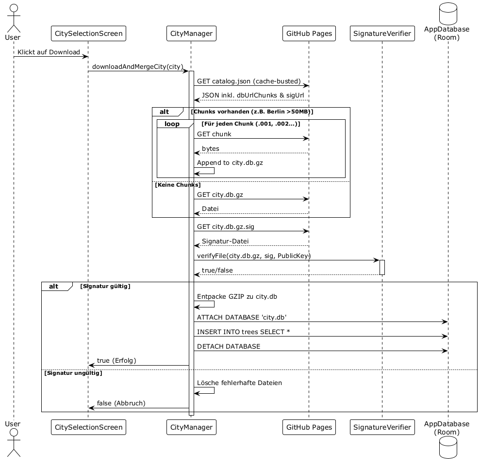
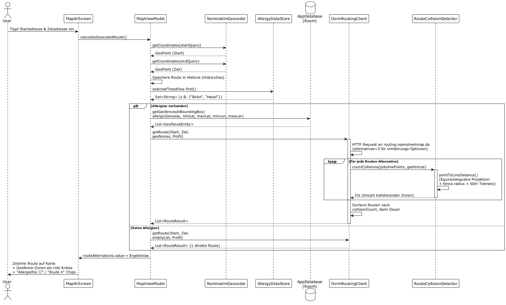
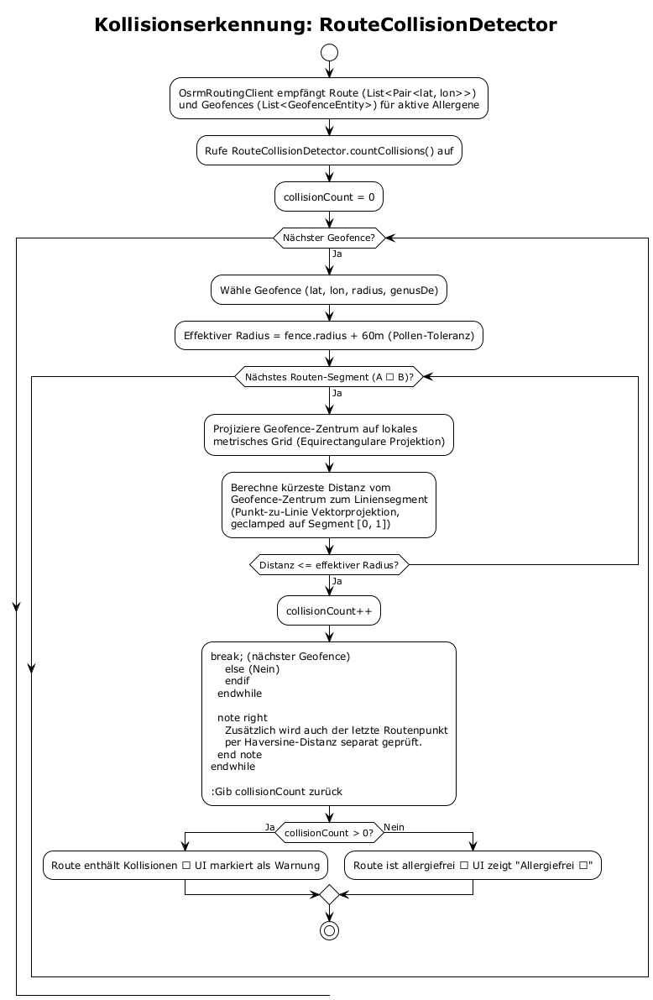

# Android App Architecture

The Baumradar Android app is a native Kotlin application built on **Jetpack Compose** (Material 3) and **Room**. Minimum Android version: **10 (API 29)**, Target SDK: **34**. It is designed to efficiently display hundreds of thousands of trees while remaining fully functional offline.

---

## Package Structure

```
at.mafue.baumradar.app
├── MainActivity.kt              # Entry point, Navigation (Wizard → Main)
├── data/
│   ├── AppDatabase.kt           # Room Database Definition
│   ├── TreeEntity.kt            # Table "trees" (id, city_id, lat, lon, genus_de, genus_en, species_de, species_en)
│   ├── GeofenceEntity.kt        # Table "geofences" (id, lat, lon, radius, count, genus_de)
│   ├── RouteHistoryEntity.kt    # Table "route_history" (start, end, timestamp)
│   ├── TreeDao.kt               # Room DAO (bounding-box queries, geofence lookups)
│   ├── HistoryDao.kt            # Room DAO for route history
│   ├── AllergyDataStore.kt      # Jetpack DataStore: selectedTrees & warnTrees Sets
│   ├── CityManager.kt           # Catalog download, chunk reassembly, signature verification, DB merge
│   └── CityCatalogEntry.kt      # Data class: id, name, country, dbUrl, dbUrlChunks, sigUrl, boundingBox
├── security/
│   └── SignatureVerifier.kt     # Ed25519 signature verification (BouncyCastle)
├── routing/
│   ├── OsrmRoutingClient.kt    # HTTP request to OSRM, parsing, integrated collision detection
│   ├── RouteCollisionDetector.kt # Point-to-line distance (equirectangular projection)
│   ├── NominatimGeocoder.kt     # Address resolution via OpenStreetMap Nominatim
│   ├── GpxGenerator.kt         # GPX export & Share intent
│   └── RouteResult.kt          # Data class (polyline, duration, distance, collisionCount)
├── ui/
│   ├── MapArScreen.kt           # Map Composable (OSMDroid), AR arrows, Routing UI, Long-Press dialog
│   ├── MapViewModel.kt          # State: Location, Trees, Routes, Geofences, Exploration mode
│   ├── ArNavigationManager.kt   # GPS tracking, Compass (Magnetometer), Haversine, Bearing
│   ├── ProfileScreen.kt         # Allergy profile UI (searchable tree list with tri-state)
│   ├── ProfileViewModel.kt     # Data sanitization, genus grouping, geofence updates
│   ├── CitySelectionScreen.kt  # City wizard and city management
│   ├── CitySelectionViewModel.kt # Catalog loading, download control
│   ├── MainScreen.kt           # Tab navigation (Map, Profile, Cities)
│   └── TaxonomyUtils.kt        # Trivial name extraction from tree lists
└── background/
    ├── GeofenceManager.kt       # Registers 99 closest geofences + 2km update zone with Android
    └── GeofenceBroadcastReceiver.kt # Receives geofence events → push notification
```

---

## 1. City Manager & Data Synchronization

The `CityManager` is the core of data provisioning. It downloads a `catalog.json` from GitHub (cache-busted with timestamp) that lists all available cities with their download URLs.

**Download workflow for a city:**
1. If `dbUrlChunks` exist (e.g., Berlin > 50MB): Download all `.001`, `.002`, ... chunks and concatenate them into a single `.db.gz` file.
2. If no chunks: Download the single `.db.gz` file.
3. Download the `.db.gz.sig` signature file.
4. **Signature verification**: `SignatureVerifier.verifyFile()` checks the `.db.gz` against the `.sig` using the hardcoded Ed25519 public key (`MCowBQYDK2VwAyEA...`). On failure: delete files, abort.
5. Decompress the GZIP to a raw `.db` SQLite file.
6. `ATTACH DATABASE` to the Room database → `INSERT INTO trees SELECT * FROM new_city_db.trees` → `DETACH`.
7. Mark the city as downloaded in SharedPreferences (`city_dn_<id>`).



**Automatic city detection:** In `MapViewModel`, an `effectiveLocation` collector checks the position every 5 seconds. If the user is within the bounding box of a city not yet downloaded, a dialog appears: *"New region detected! Would you like to download the data for X?"*

---

## 2. Map Display & Exploration Mode

The map is based on **OSMDroid** (OpenStreetMap), embedded in Compose via `AndroidView`. The `MapViewModel` controls all state:

- **`nearbyAllergicTrees`**: A reactive `StateFlow` that evaluates the combination of `effectiveLocation` (updated every 2s), `selectedTreesFlow`, `warnTreesFlow`, and `isExplorationMode`. Result: A filtered, distance-checked list of `TreeEntity` objects.
  - In **Normal mode**: Shows only trees contained in `selectedTrees` or `warnTrees`, within a 500 m radius.
  - In **Exploration mode**: Shows *all* trees within a 100 m radius, regardless of allergy profile.
- **`effectiveLocation`**: Combines the real GPS location with an optional `virtualLocation` (for testing via long-press).
- **Bounding-box query**: The Room database is efficiently queried via `getTreesInBoundingBox()` – followed by a Haversine fine-filter in Kotlin.

---

## 3. AR Compass Overlay

The class `ArNavigationManager` uses the Android `SensorManager` (Magnetometer + Accelerometer) for compass direction. `ArOverlay` (a `Canvas` Composable) draws:

- **Rotated triangle arrows** for each of the 15 closest trees that are outside the current field-of-view (60° total).
- Each arrow displays the distance in meters.
- Calculations use `calculateBearing()` (bearing between two geopoints) and `calculateDistance()` (Haversine formula).

---

## 4. Routing & Collision Detection



The routing workflow in `MapViewModel.calculateGeocodedRoute()`:

1. **Geocoding**: Addresses → coordinates via `NominatimGeocoder`.
2. **Save route to history** (up to 10 entries, older ones are pruned).
3. **Load allergies**: `AllergyDataStore.selectedTreesFlow.first()`.
4. **Load geofences**: `TreeDao.getGeofencesInBoundingBox()` with the route's bounding box (+0.05° buffer) and active allergens.
5. **Calculate route**: `OsrmRoutingClient.getRoute()` sends an HTTP request to `routing.openstreetmap.de` (profile: foot/bike/car). If allergies are active → `alternatives=3`.
6. **Count collisions** (internally in `OsrmRoutingClient`): For each route alternative, the client calls `RouteCollisionDetector.countCollisions()`.
7. **Sorting**: Routes are sorted by `collisionCount * 100000 + durationSec` – the allergen-free route is always on top.



**The algorithm in detail (`RouteCollisionDetector`):**
- For each geofence and each route segment (Point A → Point B), the shortest distance from the geofence center to the line segment is calculated.
- The calculation uses an **equirectangular projection** (conversion to a local metric coordinate system) and a **vector projection** clamped to the segment `[0, 1]`.
- The effective warning radius is: `fence.radius + 60 meters` (pollen tolerance).
- Additionally, the last route point is checked against every geofence via Haversine distance.

---

## 5. Background Geofence Notifications

This feature uses the **Google Play Services `GeofencingClient`** – an energy-efficient solution that requires no permanently running app.

**Architecture:**
- **`GeofenceManager`**: Called when the user toggles a "Warning" tree species in the profile. It:
  1. Removes all existing geofences.
  2. Queries the 99 closest geofences (of the warning tree species) from the local DB.
  3. Registers these 99 zones with Android as `GEOFENCE_TRANSITION_ENTER` geofences.
  4. Registers a 100th "update zone" geofence (2 km radius) as `GEOFENCE_TRANSITION_EXIT`.
- **`GeofenceBroadcastReceiver`**: A `BroadcastReceiver` registered in the manifest, woken by the system:
  - On **ENTER** of a tree geofence: Shows a push notification (*"Allergy Warning: You are near a potentially allergenic tree (Birch)."*)
  - On **EXIT** of the update zone: Calls `GeofenceManager.updateGeofences()` again to register the 99 nearest trees at the new location.

**Permissions:**
- `ACCESS_BACKGROUND_LOCATION` (Android 10+): Allows background location checks.
- `POST_NOTIFICATIONS` (Android 13+): Allows push notifications.

---

## Dependencies

| Library | Purpose |
|---|---|
| Jetpack Compose (BOM 2024.02) | UI framework |
| Room 2.6.1 | Local SQLite database |
| Jetpack DataStore | Persistent allergy settings |
| Google Play Services Location 21.1.0 | GPS, FusedLocationProvider, GeofencingClient |
| OSMDroid 6.1.18 | OpenStreetMap map rendering |
| OkHttp 4.12.0 | Networking (DB downloads, routing, geocoding) |
| BouncyCastle 1.77 | Ed25519 signature verification |

[Back to Start](../README_en.md) | [Deutsche Version](app_architecture.md)
