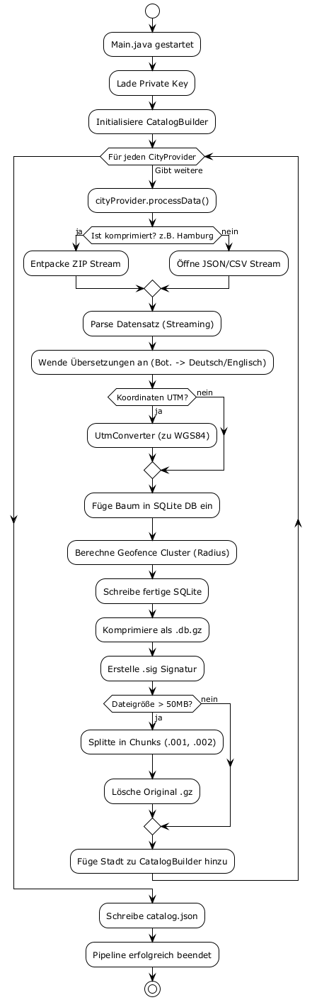
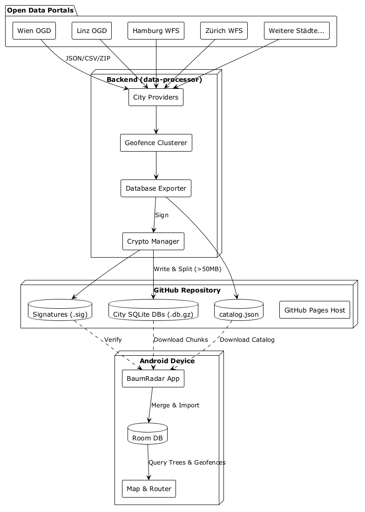
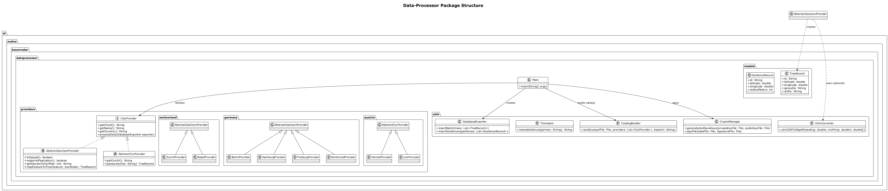

# Backend Architektur (Data-Processor)

Das Backend von Baumradar (ein Java-Projekt) ist verantwortlich für das Aggregieren und Aufbereiten der Open Data von diversen Städten. Es agiert im Wesentlichen als "Data Pipeline" oder "Data Trust".

## Ablauf und Daten-Ingestion

1. **City Providers**
   Es gibt abstrakte Basisklassen für verschiedene Formate (`AbstractGeoJsonProvider`, `AbstractCsvProvider`). Für jede Stadt existiert eine Implementierung (z.B. `ViennaProvider`, `HamburgProvider`). Diese rufen die Open Data Portale der Städte ab (teilweise ZIP-Archive, teilweise direkte APIs mit Pagination).

2. **Normierung & Übersetzung**
   Die Baumarten-Bezeichnungen variieren stark von Stadt zu Stadt. Der `Translator` vereinheitlicht botanische Namen und deutsche Bezeichnungen auf einen gemeinsamen Standard. Geokoordinaten in abweichenden Projektionen (wie UTM in Hamburg) werden mit dem `UtmConverter` zu regulären WGS84 Koordinaten umgewandelt.

3. **Geofence Clustering**
   Um Performance zu sparen, berechnet das Backend Geofence-Zonen für nah beieinander stehende Bäume derselben Art. Anstatt jeden Baum einzeln prüfen zu müssen, kann die App später mit diesen größeren Zonen kollidieren.

4. **Kryptografische Absicherung & Split**
   Das Ergebnis wird in eine performante SQLite-Datenbank exportiert und mittels `GZIP` komprimiert. 
   - Der `CryptoManager` signiert diese Datei kryptografisch (Ed25519) mit einem Private Key. Die Signatur (.sig Datei) und die Datenbank werden abgelegt.
   - Falls eine Datenbank 50MB überschreitet, wird sie in Chunks (`.001`, `.002`) aufgesplittet, um GitHub-Dateigrößen-Limits einzuhalten.

[Zurück zur Startseite](../README.md) | [English Version](backend_architecture_en.md)
