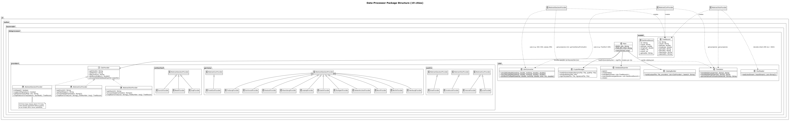
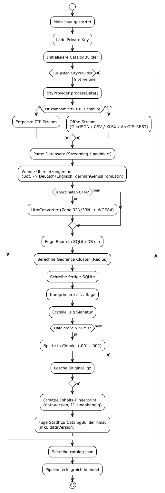
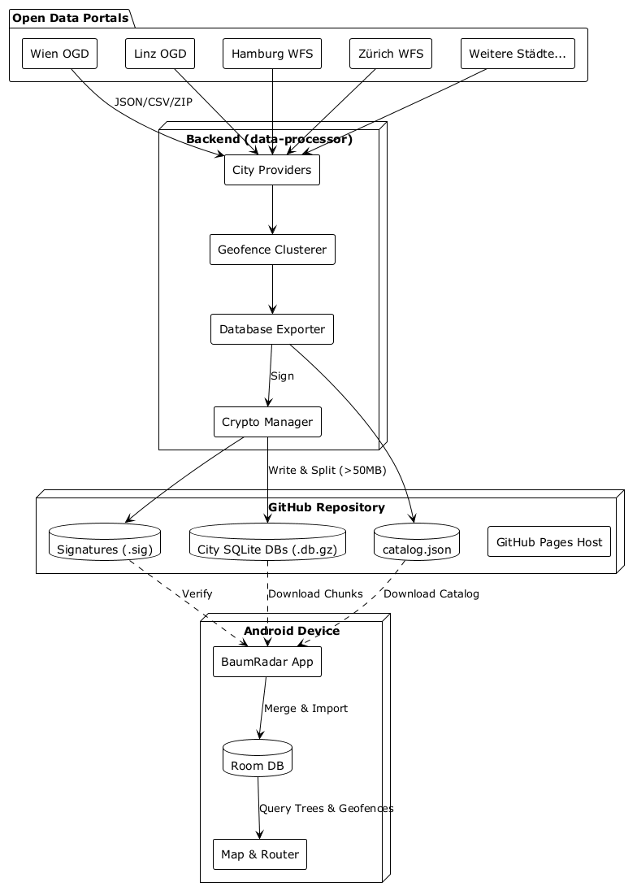

# Backend Architecture (Data-Processor)

The Baumradar backend is a **Java project** (`data-processor` module) that acts as a data pipeline. It aggregates public tree cadastre data (Open Data) from various cities, normalizes it, computes spatial geofence clusters, and exports the result as cryptographically signed SQLite databases.

---

## Package Structure

```
at.mafue.baumradar.dataprocessor
├── Main.java                    # Entry point: Orchestrates the entire pipeline
├── models/
│   ├── TreeRecord.java          # Data class: id, cityId, latitude, longitude, genusDe, genusEn, speciesDe, speciesEn
│   └── GeofenceRecord.java      # Data class: id, cityId, latitude, longitude, radius, count, genusDe
├── providers/
│   ├── CityProvider.java        # Interface: getCityId(), getName(), getCountry(), getBoundingBox(), processData()
│   ├── AbstractGeoJsonProvider.java  # Base for GeoJSON-based cities (streaming parser, pagination, ZIP support)
│   ├── AbstractCsvProvider.java      # Base for CSV-based cities (line-by-line parsing, header mapping)
│   ├── AbstractXlsxProvider.java     # Base for XLSX-based cities (e.g. Innsbruck)
│   ├── austria/                      # Vienna, Linz (CSV); Innsbruck (XLSX); Graz (ArcGIS REST)
│   ├── germany/                      # Berlin, Hamburg, Köln, Stuttgart, Freiburg, Dortmund, Rostock, Würzburg, Leipzig, Bonn (GeoJSON)
│   │                                 #   + FrankfurtProvider (CSV/UTM32N), GelsenkirchenProvider (ArcGIS Esri-JSON); Köln/Leipzig reproject UTM
│   └── switzerland/                  # ZurichProvider, BaselProvider, ZugProvider (GeoJSON)
└── utils/
    ├── DatabaseExporter.java    # SQLite creation: table setup, batch inserts, performance pragmas
    ├── CatalogBuilder.java      # Generates catalog.json with URLs, chunks, and bounding boxes
    ├── CryptoManager.java       # Ed25519 key management (load/generate), signature creation
    ├── Translator.java          # DE↔EN genus dict + Latin→German (germanGenusFromLatin)
    ├── UtmConverter.java        # UTM Zone 32N/33N → WGS84 (Cologne, Frankfurt / Leipzig)
    └── XlsxReader.java          # Lean XLSX parser (JDK zip + StAX, no dependency)
```



---

## Pipeline Workflow (Main.java)



### Step 1: Cryptographic Setup
```
CryptoManager.loadOrGenerateKeyPair(privFile, pubFile)
```
If an Ed25519 key pair already exists on disk (`private_key.b64`, `public_key.b64`), it is loaded. Otherwise, a new pair is generated and saved. The private key **never** leaves the backend; only the public key is committed.

### Step 2: Parallel City Processing
All 19 registered `CityProvider` instances are processed simultaneously via `ExecutorService` (thread pool). Per city:

1. **Download & Parse**: Depending on provider type:
   - `AbstractGeoJsonProvider`: Jackson streaming parser (`JsonFactory`), optionally with pagination (ArcGIS APIs return e.g., max. 5000 features per request) and ZIP extraction.
   - `AbstractCsvProvider`: Line-by-line `BufferedReader` parsing with configurable delimiter (`getSplitRegex()`). Headers are analyzed via `processHeaders()`.

2. **Normalization**:
   - `Translator.translateGenus()` and `translateSpecies()` unify names (e.g., various spellings of "Hänge-Birke" → consistent entry).
   - `UtmConverter.utm32NToWgs84()` is needed for cities like Hamburg whose coordinates are not in WGS84.

3. **Geofence Clustering**: During parsing, a **grid-based cluster** is computed for each tree:
   - Grid key: `genusDe + "|" + lat (3 decimals) + "|" + lon (3 decimals)` → approx. 100m × 100m cells.
   - Trees of the same genus in the same cell are merged into a single `GeofenceRecord`.
   - Radius: 50m for individual trees, 100m for tree groups (≥ 2 trees).
   - Center: Arithmetic mean of all tree coordinates in the cluster.

4. **SQLite Export**: `DatabaseExporter` creates a SQLite database with optimized pragmas (`journal_mode=OFF`, `synchronous=0`, `cache_size=100000`) and writes data in batches of 5000 into the `trees` and `geofences` tables.

5. **GZIP Compression**: The finished `.db` file is compressed as `.db.gz`.

6. **Signing**: `CryptoManager.signFile()` creates an Ed25519 signature (`.db.gz.sig`) covering the entire compressed file.

7. **Chunking** (if > 50MB): The `.db.gz` is split into 50MB chunks (`.001`, `.002`, ...). The original file is deleted, the signature remains – it applies to the reassembled file.

### Step 3: Catalog Generation
`CatalogBuilder.build()` creates a `catalog.json` containing for each city:
```json
{
  "id": "wien",
  "name": "Wien",
  "country": "Österreich",
  "boundingBox": [48.12, 16.18, 48.32, 16.58],
  "dbUrl": "https://raw.githubusercontent.com/.../wien.db.gz",
  "dbUrlChunks": ["...wien.db.gz.001", "...wien.db.gz.002"],
  "sigUrl": "https://raw.githubusercontent.com/.../wien.db.gz.sig"
}
```



---

## Adding a New City Provider

1. Create a new class (e.g., `MunichProvider`) in the appropriate country package, extending `AbstractGeoJsonProvider` or `AbstractCsvProvider`.
2. Implement the abstract methods: `getCityId()`, `getName()`, `getCountry()`, `getBoundingBox()`, and `mapFeatureToTree()` or `mapRowToTree()`.
3. Register the provider in `Main.java` in the `providers` list.
4. Done – on the next run, the city will be automatically processed, signed, and added to the catalog.

---

## Dependencies

| Library | Purpose |
|---|---|
| Jackson (Streaming + Databind) | GeoJSON parsing |
| SQLite JDBC | Database creation |
| BouncyCastle | Ed25519 cryptography |
| SLF4J + Logback | Logging |

[Back to Start](../README_en.md) | [Deutsche Version](backend_architecture.md)
