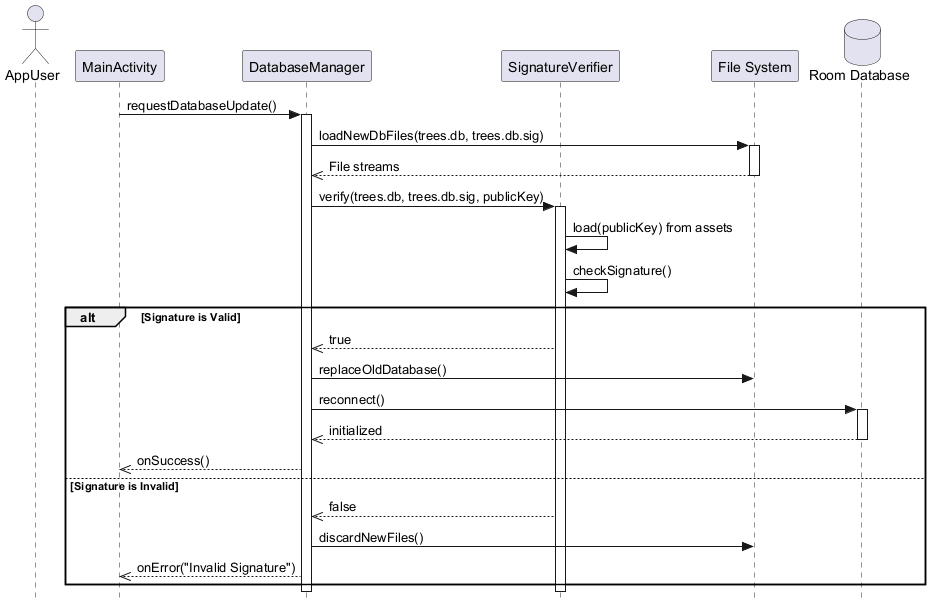

# Datenstruktur & 3rd-Party Nutzung

Ein zentrales Ziel von Baumradar ist es, die mühsame Aufbereitung von Open Data für andere Entwickler zu übernehmen. Du kannst die vom Backend generierten, bereinigten SQLite-Datenbanken direkt in deinem eigenen Projekt (z. B. iOS-App, Web-App, Datenanalyse) verwenden.

## Zero-Trust durch Ed25519-Signaturen

Damit du dir absolut sicher sein kannst, dass die Daten authentisch sind und nicht manipuliert wurden, wird jede Datenbank vom Backend signiert.
1. Im Root-Verzeichnis des Projekts (oder im `catalog.json`) wird ein **Ed25519 Public Key** bereitgestellt.
2. Wenn du eine Datei (z.B. `berlin.db.gz`) herunterlädst, lädst du auch `berlin.db.gz.sig` herunter.
3. Bevor du die Datenbank öffnest, solltest du die Datei mit dem Public Key gegen die Signatur verifizieren.

*Achtung: Falls eine Datei größer als 50MB ist, wird sie in Chunks gesplittet (`.001`, `.002`). Du musst die Chunks binär aneinanderhängen, bevor du die Gesamtsignatur prüfst und die Datei entpackst.*

## Die SQLite-Datenbank

Die entpackte `.db`-Datei beinhaltet zwei sehr einfache, leicht verständliche Tabellen:

### Tabelle `trees`
Enthält alle einzelnen Bäume.
- `id` (String): Eindeutige ID des Baumes.
- `latitude` (Double): WGS84 Breitengrad.
- `longitude` (Double): WGS84 Längengrad.
- `genusDe` (String): Deutscher Name der Baum-Gattung (z.B. "Birke").
- `artDe` (String): Spezifische Art (falls bekannt).

### Tabelle `geofences`
Berechnete Zonen für zusammenhängende Bäume derselben Art. Praktisch für Routen-Kollisionsberechnungen, da du nicht zehntausende einzelne Bäume prüfen musst.
- `id` (String): Eindeutige Zonen-ID.
- `latitude` (Double), `longitude` (Double): Zentrum der Zone.
- `radiusMeters` (Int): Radius in Metern (z.B. 50m für Einzelbäume, 100m für Baumgruppen).

## Nutzung
Hole dir die Einstiegs-JSON (`catalog.json`). Darin stehen die direkten Download-Links zu den Datenbanken und Signaturen der unterstützten Städte.

[Zurück zur Startseite](../README.md) | [English Version](data_structure_en.md)
