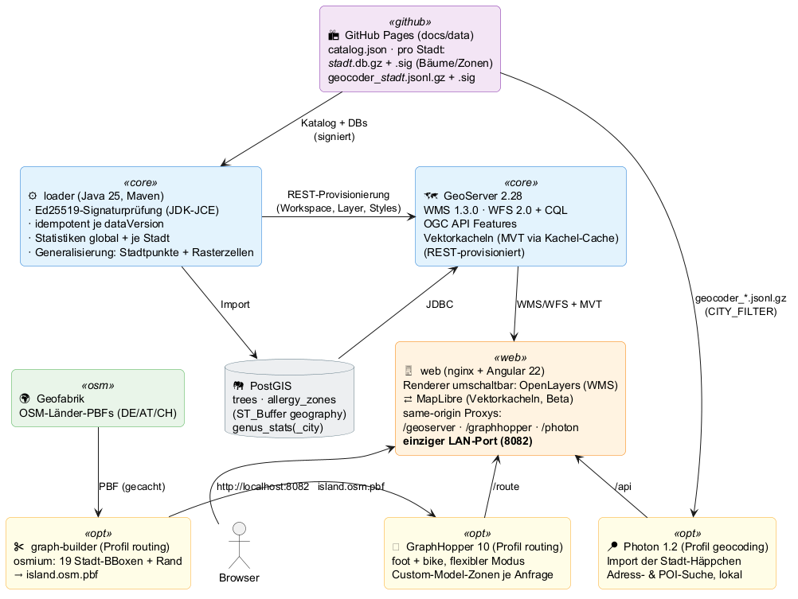
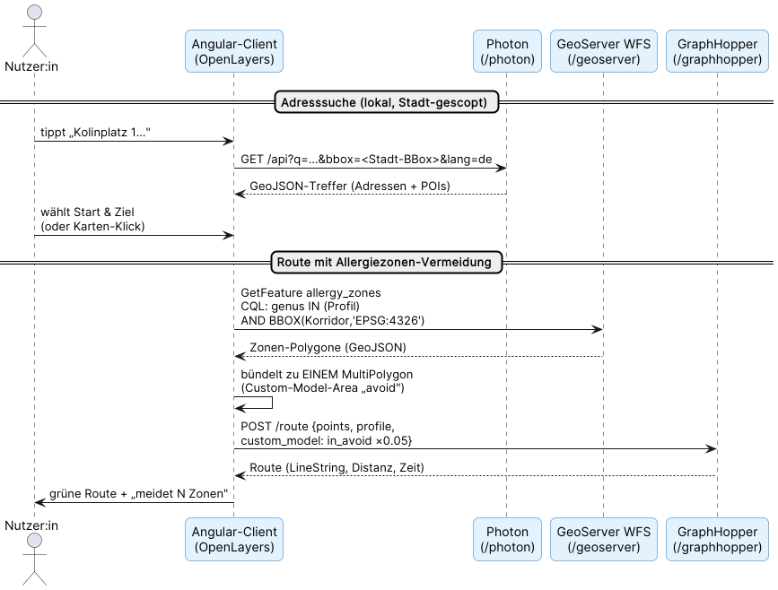

# WebGIS-Architektur (Tech-Demo)

Das BaumRadar-WebGIS ist ein **vollständig lokal betreibbares Geoinformationssystem** im Ordner [`webgis/`](../webgis/): PostGIS, GeoServer, ein Angular/OpenLayers-Client, GraphHopper-Routing und ein Photon-Geocoder — alles als Docker-Compose-Stack, gestartet mit einem einzigen Skript. Es konsumiert **dieselben signierten Datenbestände wie die Android-App** (GitHub Pages, `docs/data/`) und zeigt, wie man aus einer Open-Data-Pipeline heraus ein OGC-konformes GIS samt Offline-Routing und Offline-Adresssuche aufbaut.



---

## Leitidee: kleine, signierte Häppchen pro Stadt

Die zentrale Design-Entscheidung des gesamten Projekts zieht sich auch durchs WebGIS: **Daten werden einmal zentral aufbereitet und pro Stadt publiziert** — jede Instanz lädt nur, was sie braucht.

| Datenart | Quelle (roh) | publiziert pro Stadt | Beispiel Zug | Beispiel Köln |
|---|---|---|---|---|
| Bäume + Allergiezonen | 19 Baumkataster (CSV/GeoJSON/WFS/XLSX) | `<stadt>.db.gz` + `.sig` | ~2 MB | ~7 MB |
| Geocoder (Adressen + POIs) | Photon-Planet-Dump (**25,9 GB**) | `geocoder_<stadt>.jsonl.gz` + `.sig` | 25 MB | 176 MB |
| Routing-Graph | Geofabrik-Länder-PBFs (DE ~4 GB) | *(lokal geschnitten: Insel-PBF)* | — | — |

Der Effekt in Zahlen: Wer die Webapp nur mit Zug ausprobiert, lädt für die **Adresssuche 25 MB statt der 11 GB**, die die fertigen Photon-Länder-Indizes (DE+AT+CH) wiegen würden — bei **identischer Suchqualität** innerhalb des Stadtgebiets, denn es ist derselbe Photon mit denselben Dokumenten, nur räumlich beschnitten.

Alle publizierten Artefakte sind **Ed25519-signiert** und tragen eine **inhaltsbasierte Version** (`dataVersion` bzw. `geocoderVersion`) im [`catalog.json`](data_structure.md) — Konsumenten erkennen daran sowohl Manipulation als auch Veraltetes.

---

## Container im Überblick

| Service | Technik | Aufgabe | Compose-Profil |
|---|---|---|---|
| `loader` | Java 25, Maven, Virtual Threads | Katalog laden → Signaturen prüfen → PostGIS-Import → GeoServer-Provisionierung | *(Basis)* |
| `postgis` | PostGIS 17/3.5 | Laufzeit-Store: `trees`, `allergy_zones`, Statistiken | *(Basis)* |
| `geoserver` | GeoServer 2.28 | OGC-Dienste: WMS 1.3.0, WFS 2.0 (+CQL), OGC API Features | *(Basis)* |
| `web` | nginx + Angular 22/OpenLayers 10 | Karte, Filter, Routing-UI; same-origin-Proxys | *(Basis)* |
| `graph-builder` | osmium-tool, jq | Stadt-BBoxen aus Länder-PBFs schneiden → `island.osm.pbf` | `routing` |
| `graphhopper` | GraphHopper 10 | foot/bike-Routing, Zonen-Vermeidung per Custom Model | `routing` |
| `photon` | Photon 1.2 (OpenSearch) | lokale Adress- & POI-Suche aus den Stadt-Häppchen | `geocoding` |

Der Start ist bewusst trivial gehalten (**nur Docker nötig** — kein Java, kein Node auf dem Host):

```powershell
cd webgis
.\start.cmd -Cities zug     # Linux/macOS: ./start.sh --cities zug
```

Das Skript erzeugt beim ersten Lauf die `.env` **mit zufälligen Passwörtern**, baut die Images und startet den Stack — **Routing und Adresssuche laufen standardmäßig mit** (abwählbar per `-NoRouting`/`-NoGeocoding`). `CITY_FILTER` gilt einheitlich für Loader, Routing **und** Geocoder.

---

## Der Loader: Verify → Import → Provisionierung

Der Loader ist das Java-Gegenstück zum `data-processor` — nur konsumierend statt produzierend, und bewusst als **eigenständiges Maven-Projekt** (der App-Teil ist durch AGP an Gradle gebunden; hier gibt es keine Android-Rücksichten, daher Java 25 mit Virtual Threads, Records und `java.net.http`).

1. **Katalog + Stadt-Auswahl**: `catalog.json` von GitHub Pages, gefiltert über `CITY_FILTER`.
2. **Idempotenz**: Pro Stadt wird die importierte `dataVersion` in `import_state` gemerkt — ein erneutes `docker compose up` überspringt unveränderte Städte in Millisekunden.
3. **Signaturprüfung ohne Krypto-Dependency**: Ed25519 steckt seit JDK 15 in der Standard-JCE (`KeyFactory.getInstance("Ed25519")`). Die App bündelt BouncyCastle nur, damit die Prüfung auch auf älteren Android-*Geräten* funktioniert (unterstützt ab Android 10, wo der System-Provider Ed25519 noch nicht kennt) — der Loader auf Desktop-JDK braucht das nicht.
4. **Geodätisch korrekte Zonen**: Die Allergiezonen liegen als *Mittelpunkt + Radius in Metern* vor. Ein Buffer in Grad wäre breitengradabhängig falsch; deshalb:
   ```sql
   ST_Buffer(ST_SetSRID(ST_MakePoint(lon, lat), 4326)::geography, radius_m)::geometry
   ```
   Der Umweg über den `geography`-Typ buffert in echten Metern auf dem Ellipsoid.
5. **Statistiken als Tabellen statt Views**: `genus_stats` (global) und `genus_stats_city` (je Stadt) werden nach jedem Import per `GROUP BY` neu befüllt — damit WFS-Zugriffe des Clients nicht bei jedem Request 2,6 Mio Zeilen aggregieren.
6. **GeoServer als Code**: Workspace, PostGIS-Datastore, SLD-Styles und alle Layer entstehen idempotent über die **REST-API** — keine Klick-Konfiguration, der Stack ist reproduzierbar.

---

## OGC-Dienste

GeoServer publiziert die PostGIS-Tabellen standardkonform:

- **WMS 1.3.0** rendert Bäume und Zonen serverseitig (SLD-Styles); der Client fordert nur sichtbare Kacheln an — 2,6 Mio Punkte bleiben performant.
- **WFS 2.0 + CQL** liefert Features als GeoJSON; der Client nutzt es für Statistiken, die Such-Grundlage und die **Korridor-Zonen des Routings**.
- **OGC API Features** (stabile Extension ab GeoServer 2.27) ist der moderne REST/JSON-Zugang zu denselben Daten.

Filter werden als CQL kombiniert — Gattungs-Auswahl und Stadt-Scoping wirken auf WMS **und** WFS gleich:

```
genus_de IN ('Birke','Hasel') AND city_id = 'wien'
```

---

## Client: Angular 22 + OpenLayers, ohne Wrapper

- **Zoneless + Signals**: Der gesamte UI-Zustand lebt in Signals; drei `effect()`s übersetzen Zustandsänderungen in imperative Karten-Aufrufe. Die OpenLayers-Karte selbst entsteht in `runOutsideAngular` — OL feuert hochfrequente Events (`pointermove`, `postrender`), die keine Change Detection auslösen sollen.
- **Same-Origin-Proxys statt CORS**: nginx reicht `/geoserver`, `/graphhopper` und `/photon` an die Container durch. Der Client kennt nur relative URLs; im Dev-Modus übernimmt `proxy.conf.json` dieselbe Rolle. Kein CORS-Setup, keine Origin-Probleme.
- **Stadt-Auswahl ist ein echter Filter**: Sie zoomt nicht nur, sondern scopt die Gattungszahlen (aus `genus_stats_city`), die Karten-Layer (CQL) und die Adresssuche (BBox-Parameter). „Ahorn" zeigt in Wien 50.241 Bäume — nicht die globale halbe Million.
- **Suche wie im App-Profil**: Gattungs- *und* Artnamen, deutsch wie botanisch („Acer" findet Ahorn); die Auswahl bleibt gattungsweit, passend zu den genus-geclusterten Zonen.

---

## Routing: Insel-Graph + Korridor-Zonen



**Insel-Graph:** Der `graph-builder` lädt die Geofabrik-Länder-PBFs (einmalig, Volume-gecacht), schneidet mit `osmium extract` die 19 Stadt-BBoxen (+ Rand) heraus und merged sie zu **einem** `island.osm.pbf` (~einige hundert MB statt ~5 GB). Routing funktioniert innerhalb jeder Stadt; zwischen den Städten gibt es bewusst keine Verbindung. GraphHopper baut daraus beim ersten Start seinen Graph (Cache im Volume) — Profile `foot` und `bike`, **flexibler Modus** (kein Contraction-Hierarchies-Preprocessing), damit pro Anfrage ein Custom Model mitgegeben werden kann. Ein **Bauplan-Marker** (`island.marker`: gewählte Städte, BBoxen, Rand — gleiche Idee wie Photons `imported_versions`) macht den graph-builder idempotent: Ist der Bauplan unverändert und die Insel vorhanden, überspringt ein erneuter Start Extraktion und Merge in Sekunden, und auch der GraphHopper-Cache bleibt gültig. Neubau mit frischeren OSM-Daten erzwingen: Volume `routingdata` löschen.

**Zonen-Vermeidung (Schlauch-Ansatz, zwei Pässe):** Tausende Kreis-Zonen kann man GraphHopper nicht global vorwerfen. Stattdessen holt der Client **pro Routenanfrage** nur die relevanten Zonen:

1. **Basisroute ohne Meidung** rechnen — sie definiert den **Schlauch** (Segment-BBoxen ~400 m um die Linie, als CQL-`OR`-Kette), in dem Zonen überhaupt relevant sind. Eine einzige Start–Ziel-BBox wäre bei Diagonalrouten die halbe Stadt: Zonen 10 km abseits zählten mit und fraßen das Limit auf.
2. WFS-Query der Schlauch-Zonen **je Gattung einzeln** (Budget: 800 ÷ Anzahl Gattungen; die Polygone gehen als POST-Body an GraphHopper, nginx-Limit dafür 16 MB). Wichtig: Ein gemeinsames `IN (…)`-Limit bevorzugt am Deckel die Gattung mit den „ersten" Tabellenzeilen und verschluckt andere komplett — live beobachtet: Birke+Linde ergab exakt die Birken-Route. Die Treffer werden zu **einem MultiPolygon** gebündelt (eine Custom-Model-Area, eine Bedingung). **Konvergenz:** Schiebt die Meidung die Route aus dem bisherigen Schlauch hinaus, werden die Zonen entlang der *neuen* Route nachgeladen, die Mengen vereinigt und neu gerechnet — bis nichts Neues mehr auftaucht (max. 2 Nachrunden). Erst wenn Optimierung und Zählung **dieselbe** Zonen-Menge sehen, sind die Vergleichszahlen widerspruchsfrei (vorher konnte „der Umweg" mehr Zonen queren als die Direktroute). **Zonen-Cache:** Je Strecke (Profil + Start + Ziel) merkt sich der Client Basisroute und konvergierte Zonen, Gattungen einzeln; Faktor-Wechsel kosten dann ~1,5 s statt ~10 s (Wien gemessen), neue Gattungen laden nur ihr eigenes Delta. Der Cache ist bewusst nur ein *Startwert* — die Konvergenz-Verifikation läuft immer mit und füttert ihn additiv zurück.
3. GraphHopper bekommt `priority: [{ if: "in_avoid", multiply_by: <Faktor> }]` — Kanten in Zonen werden abgewertet, aber nie verboten (**weiche Vermeidung**: eine Route, die *in* einer Zone startet, funktioniert immer). Die Stärke wählt man im Client unter „Erweiterte Optionen": *„lieber queren als N-facher Umweg"* mit N = 5/10/**20 (Standard)**/50/100 (≙ `multiply_by` 0,2 … 0,01) — bei 100-fach ist die Meidung praktisch strikt, ohne die Fallstricke einer harten Sperre.
4. **Querungs-Statistik + Direktrouten-Vergleich im Client:** GraphHopper meldet nicht, welche Areas eine Route durchquert — der Client tastet beide Linien daher in ~25-m-Schritten ab (Ray-Casting gegen die Zonen-Polygone) und zeigt „quert N Zonen (X km in Zonen)" für die Meide-Route (grün bei 0, Tooltip je Gattung) neben „M berücksichtigt" — und darunter die **Direktroute** (Pass 1 fällt ohnehin an) als gestrichelte Vergleichslinie mit denselben Kennzahlen. Wien-Messung (Linde, 50-fach): direkt 16,5 km mit 6,3 km *in* Zonen — Meide-Route 26,1 km mit 147 m in Zonen.

Messbeispiel (Zug, foot): Basis 1.438 m → mit 49 Ahorn-Zonen im Schlauch 1.884 m (+446 m Umweg um die Zonen). Gattungs- und Faktor-Änderungen berechnen eine bestehende Route automatisch neu.

*Bewusst verworfen:* Ein globales Vor-Aggregieren aller Zonen (die sind bereits geclustert — nochmaliges `ST_Union` verpackt nur Unverbundenes um) und das Markieren betroffener Graph-Kanten beim Import (skalierbarer, aber Custom-GraphHopper-Build; der Korridor-Ansatz kommt mit Stock-GraphHopper aus).

---

## Geocoding: der zerschnittene Planet

Adress- und POI-Suche („TU Wien", „Kolinplatz 1") lokal, ohne 11-GB-Länder-Indizes:

1. **Quelle** ist der offizielle **Photon-Planet-Dump** (`.jsonl.zst`, 25,9 GB) — zeilenweise JSON-Batches, jeder Ort mit `centroid`-Koordinate.
2. Der **GeocoderCutter** im `data-processor` streamt den Dump **einmal** (zstd → Jackson-Streaming, ~38 min für 367 Mio Orte) und verteilt jeden Ort auf die Stadt-Dateien, deren BBox+15-km-Rand ihn enthält. Jede Datei behält Kopf- und CountryInfo-Zeile — sie bleibt ein **eigenständig Photon-importierbarer Dump**.
3. Publiziert wird pro Stadt (`geocoder_<stadt>.jsonl.gz`, signiert, >50 MB gechunkt), Aktualisierung über die Backend-Runner-UI je Stadt einzeln — Straßennamen ändern sich träge, quartalsweise reicht.
4. Der **photon-Container** besorgt sich beim ersten Start die Häppchen der `CITY_FILTER`-Städte — liegt das Repository vollständig lokal vor, direkt aus `docs/data/` (read-only-Mount `/local-data`, **kein GitHub-Download**), sonst von GitHub Pages —, merged sie (Präambel-Zeilen der Folge-Dateien überspringen — Photon 1.x erlaubt nur *einen* Import pro Datenbank) und bedient dann `/api` inkl. Tippfehler-Toleranz, POIs und `bbox`-Scoping.
5. Fällt die lokale Instanz aus (Profil nicht gestartet), wechselt der Client transparent auf **photon.komoot.io** — mit sichtbarem Hinweis, dass Anfragen den Rechner verlassen.

Ein Ort im Überlappungsbereich zweier Stadt-Ränder (Ruhrgebiet!) landet bewusst in beiden Dateien — jede Datei ist eigenständig vollständig. Die **Deduplizierung übernimmt der photon-Entrypoint beim Zusammenführen** (jq zerlegt Batch-Zeilen mit mehreren Orten, awk lässt je `place_id` nur die erste Fundstelle durch): Photon selbst lehnt Duplikate ab (`op_type=create` → HTTP 409) und würde sonst den gesamten Import abbrechen.

---

## Lade-Status: ehrlich statt geraten

Der erste Start lädt und baut — je nach Städte-Auswahl und Leitung — Minuten bis Stunden. Der Web-Client macht das sichtbar: ein **rotierender Ring um das Logo**, solange Module fehlen; per Hover ein Overlay mit dem Stand pro Modul. Die Anzeige speist sich aus **echten Signalen** statt aus Wanduhr-Schätzungen:

1. **`stack.json`** — ein nginx-Entrypoint-Skript schreibt beim Container-Start, was dieser Stack laden *soll* (Profile `routing`/`geocoding` + `CITY_FILTER`, vom Start-Skript durchgereicht). Abgewählte Module erscheinen so als „deaktiviert" statt ewig als „lädt".
2. **`/status/<job>.json`** — die Entrypoint-Skripte von graph-builder, graphhopper und photon spiegeln ihre Fortschritts-Meldungen (`{phase, detail, updatedAt}`) in ein geteiltes Volume, das nginx read-only ausliefert. Das Overlay zeigt damit dieselbe Phase wie `docker logs` — „schneidet Stadt-Ausschnitte 3–4/12", „baut Suchindex" —, nur ohne Terminal.
3. **Live-Probes** gegen GeoServer, WFS-Daten, GraphHopper und Photon sind das einzige „bereit" — grün wird nur, was tatsächlich antwortet.

Bewusst **kein Timeout**: ein Erststart darf legitim Stunden dauern (große Städte, langsame Leitung). Stattdessen eine **Staleness-Warnung** — bewegt sich der `updatedAt`-Stempel einer laufenden Phase 15 Minuten nicht, meldet das Overlay „hängt evtl. (docker logs)". Damit lange *Einzelschritte* (5-GB-Download, stundenlanger Index-Bau in einem einzigen Java-Aufruf) nicht fälschlich als hängend gelten, stempeln sie per **Herzschlag** minütlich neu — beim Download gleich mit Fortschritt („Deutschland von download.geofabrik.de: 3.412 MB geladen"). So fällt nur ein wirklich stehender Job auf.

---

## Sicherheit (Heim-/Schulnetz-tauglich)

- **Keine Default-Passwörter**: `start.cmd`/`start.sh` generiert beim Anlegen der `.env` zufällige Zugangsdaten für PostGIS und GeoServer. (Das PostGIS-Passwort wird bei der ersten Volume-Initialisierung eingebrannt — späteres Ändern braucht `docker compose down -v`.)
- **Nur localhost**: GeoServer-Admin, PostGIS, GraphHopper und Photon binden per Default auf `127.0.0.1`. **Einzig der Web-Client (8082) ist im LAN sichtbar** — er reicht ausschließlich lesende Dienste same-origin durch (kein Admin-Zugang, kein WFS-T). Bewusster LAN-Zugriff: `BIND_HOST=0.0.0.0`.

---

## Stolpersteine (Lessons Learned)

Dinge, die erst der echte Betrieb gezeigt hat — dokumentiert, weil man an ihnen etwas lernt:

| Stolperstein | Symptom | Ursache & Lösung |
|---|---|---|
| **CQL-BBOX-Achsenreihenfolge** | WFS-Query liefert 0 Zonen, obwohl 918 existieren | GeoServer interpretiert `BBOX(geom, …)` bei EPSG:4326 als **lat,lon**. Mit explizitem CRS gilt lon,lat: `BBOX(geom, minLon, minLat, maxLon, maxLat, 'EPSG:4326')` |
| **GraphHopper 10: Pflichtparameter** | Container startet in Endlos-Restart-Schleife | `import.osm.ignored_highways` ist ab GH 10 **zwingend** (für foot/bike: `motorway`) |
| **Photon 1.x: Import verwirft** | Nach Import mehrerer Städte ist nur die letzte suchbar | Jeder `photon import` **löscht** den bestehenden Index → alle Stadt-Dumps zu einem mergen, einmal importieren |
| **Photon 1.x: CLI + Bind** | „database not found" trotz Import; API von außen unerreichbar | Neue Command-Syntax (`photon import` / `photon serve`) und Default-Bind `127.0.0.1` → `-listen-ip 0.0.0.0` im Container |
| **Chunks sind Byte-Scheiben** | `gunzip` einzelner Chunks: „unexpected end of file" | Die 50-MB-Chunks sind Scheiben **einer** gz-Datei: erst binär konkatenieren, dann entpacken |
| **nginx + optionale Upstreams** | nginx startet nicht, wenn `graphhopper`/`photon` (Profil aus) fehlen | `resolver 127.0.0.11` + Upstream in einer **Variablen** → DNS wird erst pro Request aufgelöst, nginx startet immer |
| **Opendatasoft-Exportlimit** | Stadt liefert exakt 9.997/10.000 Bäume | `/exports/geojson` kappt bei `offset+limit>10000` → Single-Shot ohne Paging (traf Dortmund *und* Basel) |
| **`jq`: Kontext in Funktionsargumenten** | `Cannot index array with string "id"` | In `$ids \| index(.id)` wird `.id` gegen `$ids` ausgewertet — die ID **vorher binden**: `.id as $cid` |
| **PowerShell 5.1 liest UTF-8 ohne BOM als ANSI** | `start.cmd` scheitert auf frischem Rechner mit wirren Parse-Fehlern (`läuft`, „fehlende Klammer"); später tauchte derselbe Umlaut-Salat in der *generierten* `.env` auf | `start.cmd` ruft *Windows PowerShell 5.1* auf, die BOM-lose UTF-8-Dateien in der ANSI-Codepage liest — das betrifft **beide Richtungen**: das `.ps1` selbst (ein Gedankenstrich `E2 80 94` enthält Byte `0x94` = cp1252-**Anführungszeichen**, das Strings vorzeitig schließt) *und* alles, was das Skript per `Get-Content` liest und wieder wegschreibt (`.env.example` → `.env`). Lösung: `.ps1` **mit UTF-8-BOM** speichern, typografische Zeichen meiden, und Dateiinhalte über **explizite .NET-APIs** verarbeiten (`[IO.File]::ReadAllText/WriteAllText` mit `UTF8Encoding`) statt über `Get-Content`/`Set-Content`-Defaults. (Tückisch: unter pwsh 7 funktioniert beides auch ohne — testen muss man den `start.cmd`-Pfad.) |
| **Git `autocrlf` bricht Container-Skripte** | `graph-builder` stirbt sofort: „exit 127" — ohne jede weitere Meldung | Git für Windows checkt mit `core.autocrlf=true` Shell-Skripte mit **CRLF** aus; im Linux-Container wird der Shebang zu `bash\r` → Interpreter „nicht gefunden" = exit 127. (ZIP-Downloads sind nicht betroffen — nur Git-Checkouts!) Doppelter Schutz: `.gitattributes` mit `*.sh text eol=lf` **und** `sed -i 's/\r$//'` im Dockerfile nach dem `COPY`. |
| **Docker Desktop bricht langes `compose up`-Warten ab** | Nach Minuten: `request returned 500 Internal Server Error … dockerDesktopLinuxEngine` | Docker Desktop (Windows) wirft beim Status-Pollen über die Pipe gelegentlich interne Fehler — besonders während langer One-Shot-Jobs (PBF-Downloads). Die **detached gestarteten Container laufen weiter**; nur das CLI-Warten stirbt. Gegenmittel: Start-Skript erneut ausführen (idempotent) — und **Downloads atomar machen** (`.part` + `mv`, `curl -C -`), damit ein Abbruch nie eine halbe Datei als „fertig" hinterlässt. |
| **osmium-Multi-Extract wird vom OOM-Killer erschossen** | `graph-builder`: `Killed  osmium extract …` → exit **137** (= SIGKILL) — auf dem 96-GB-Entwicklungs-PC lief es | `osmium extract` hält **pro Extrakt eine Bitmap über den globalen Node-ID-Raum** — gemessen ~1,5–2,5 GB, *unabhängig von der Stadtgröße* (die IDs einer Stadt sind über 20 Jahre OSM-Historie im ganzen ID-Raum verstreut). 12 Städte in einem Lauf ≈ 18 GB → tot selbst auf 16-GB-VMs. Fix: **eine Stadt pro osmium-Lauf** (`EXTRACT_BATCH=1`, kalibriert: läuft ab ~3 GB Docker-VM; auf großen Maschinen erhöhen) + `-s simple`. Merksatz: exit 137 heißt fast immer „zu wenig Speicher" — und „bei mir läuft's" heißt oft nur „mein RAM ist größer". |
| **Ein einziger Daten-Upstream ist ein SPOF** | `graph-builder` stirbt nach Sekunden mit exit **22** (= `curl -f`: HTTP ≥ 400) — am Vortag lief derselbe Stand woanders fehlerfrei | Geofabrik hatte einen schlechten Tag (live gemessen: Homepage ok, PBF-Downloads mal kaputtes 302, mal Verbindung steht ohne je zu antworten) — und der Download-Pfad kannte **genau eine Quelle**. Fix: je Land eine **Mirror-Kaskade** (Geofabrik → GWDG bzw. osm.fr, je 3 Runden) plus **Stall-Erkennung** (`--speed-limit/--speed-time`: Abbruch nur bei < 10 KiB/s über 60 s — ein Gesamt-Timeout wäre bei mehrstündigen Erstdownloads wieder eine Wanduhr-Schätzung). Wichtig: das `.part`-Resume darf **nicht quellübergreifend** fortsetzen (Merkzettel `.part.src`) — Mirrors sind nicht byte-identisch, ein gemischtes `.part` wäre still korrupt. Merksatz: alles, was genau einen Upstream hat, fällt genau dann aus, wenn man es vorführen will. |
| **`restart: unless-stopped` + crashender Einmal-Import = Endlosschleife** | Overlay zählt die Städte **immer wieder von vorn** hoch, „läuft seit 3 min" nach 12 Stunden, SSDs glühen die ganze Nacht (~18 GB Schreiblast **pro Runde**) | Der Photon-Import (ein einziger, langer Java-Lauf) stürzte ab (Ursache: Duplikate, siehe nächste Zeile — zuerst fälschlich dem Heap zugeschrieben), der Container beendete sich, und `restart: unless-stopped` startete brav wieder von vorn. Ein One-Shot-Schritt in einem Immer-neu-starten-Container braucht **zwingend einen Absturz-Zähler**: nach 3 Fehlversuchen hält der Entrypoint jetzt ehrlich an (`sleep infinity`), der Status nennt Versuch und Abhilfe, und geänderte Einstellungen setzen den Zähler automatisch zurück (der Import-Heap ist seither per `.env` regelbar). Merksatz: „läuft seit 3 Minuten" nach 12 Stunden ist keine Uhr, sondern ein Kreisverkehr. |
| **„Dedupliziert schon" — behauptet statt verifiziert** | 19-Städte-Import stirbt nach 4,35 Mio Orten: `version_conflict_engine_exception … 2911 failed items in bulk` — jede Stadt einzeln importiert fehlerfrei | Die Stadt-Ränder überlappen bewusst (jede Datei ist eigenständig vollständig — ein Ort darf in mehreren liegen). Die Doku behauptete „Photon dedupliziert über die place_id" — **eine Annahme, als Fakt aufgeschrieben**: Photon importiert mit `op_type=create`, jedes Duplikat ist ein 409, und der Import platzt komplett. Aufgeflogen erst beim ersten echten Mehr-Städte-Import — Einzelstadt-Tests *können* diesen Fehler nicht finden, weil erst die Überlappung ihn erzeugt. Fix: Dedup beim Mergen im Entrypoint (jq zerlegt Batch-Zeilen, awk: erste Fundstelle je `place_id` gewinnt). Merksatz: Was die Doku über Fremdverhalten behauptet, ist so lange Fiktion, bis ein Test es bestätigt — und Überlappungs-Features brauchen Überlappungs-Tests. |
| **`set -euo pipefail` + SIGPIPE = lautloser Tod** | `bash start.sh` unter Linux: Prompt kommt sofort zurück, **null Ausgabe** (Exit-Code 141) | Die Passwort-Erzeugung las endlos `/dev/urandom` durch `tr` und kappte mit `head -c 24`: `head` schließt nach 24 Zeichen die Pipe, `tr` stirbt am **SIGPIPE** (128+13 = 141), `pipefail` macht daraus einen Pipeline-Fehler, `set -e` bricht ab — noch **vor der ersten Meldung**. Ausgerechnet die Robustheits-Flags machten den Fehler unsichtbar; aufgefallen erst beim allerersten Linux-Lauf des Skripts (Windows nutzt `start.ps1`). Fix: endliche Byte-Menge lesen (`head -c 512 /dev/urandom \| tr -dc …`) und erst **in Bash** kürzen (`${raw:0:24}`) — so liest jeder Konsument bis EOF, niemand schließt früh. Dazu eine Banner-Ausgabe als allererste Zeile, damit das Skript nie wieder *komplett* stumm sterben kann. Merksatz: Exit 141 ohne Ausgabe = SIGPIPE unter `pipefail` — `head`/`grep -m`/`… \| true` hinter unendlichen Quellen sind die üblichen Verdächtigen. |

---

## Verwandte Dokumente

- [Glossar](glossary.md) — alle hier verwendeten Begriffe, Dienste und Standards erklärt
- [`webgis/README.md`](../webgis/README.md) — Schnellstart, Dienste-Tabelle, Konfiguration
- [Backend / Data-Processor](backend_architecture.md) — die produzierende Seite der Pipeline (inkl. GeocoderCutter)
- [Datenstruktur & Third-Party](data_structure.md) — `catalog.json`, Datenbank-Schema, eigene Konsumenten bauen
- [App-Architektur](app_architecture.md) — die Android-Seite derselben Datenbestände
